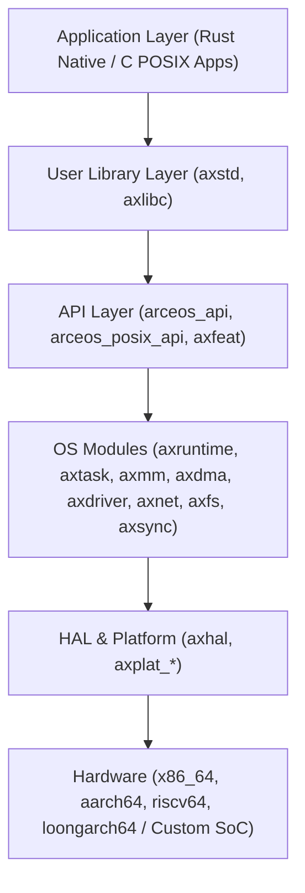

# ArceOS 核心架構深度解析與研讀報告

## 1. ArceOS 概述與設計哲學

[ArceOS](https://github.com/arceos-org/arceos) 是一個由清華大學等團隊發起、基於 **Rust 語言** 開發的模組化開源作業系統（Unikernel / Library OS），深受 [Unikraft](https://github.com/unikraft/unikraft) 的設計思想啟發。

其核心哲學可以概括為：**「積木式解耦（Lego-like Modularity）」** 與 **「極致零成本抽象（Zero-cost Abstraction）」**。

### 1.1 Unikernel vs 傳統宏內核 (Monolithic) vs 微內核 (Microkernel)

| 特性維度 | 傳統 Linux (宏內核) | seL4 / Zircon (微內核) | ArceOS (Unikernel / LibOS) |
| :--- | :--- | :--- | :--- |
| **特權級與位址空間** | 嚴格拆分 Ring 3 (User) / Ring 0 (Kernel)，雙位址空間 | 內核極小化，驅動與服務在獨立 User 空間，頻繁 IPC | **單一位址空間 (Single Address Space)**，全運行於特權級 (如 RISC-V S/M 態、ARM EL1) |
| **系統調用開銷** | Syscall 需觸發中斷/特權跳轉、暫存器保存與恢復、TLB 刷新 | IPC 傳遞開銷大、頻繁上下文切換 | **函數調用級別 (Function Call)**，無 Syscall 懲罰與特權級切換 |
| **記憶體拷貝** | 應用緩衝區需在用戶空間與內核空間複製 (copy_from_user) | 多進程 IPC 數據傳遞需額外拷貝或共享記憶體映射 | **零拷貝 (Zero-Copy)**，指標直接在應用與硬體驅動間傳遞 |
| **客製化剪裁能力** | 配置複雜 (Kconfig)，子系統間隱式耦合深 | 依賴外部框架組合用戶態服務 | **編譯期 Feature 級裁剪**，無用模組不進入最終二進位 |
| **二進位體積** | 數 MB 至數十 MB | 內核數百 KB，但系統需配合多個服務進程 | **數十 KB 至數 MB**，最小化 helloworld 僅數十 KB |
| **啟動時間** | 數秒至數十秒 | 數十毫秒至數百毫秒 | **數毫秒 (Sub-millisecond / Millisecond 級)** |
| **執行延遲確定性** | 弱（背景守護進程、頁面置換、中斷抖動） | 較強 | **極強（無後台雜訊，單一任務全速運行）** |

---

## 2. ArceOS 分層架構與模組劃分

ArceOS 的代碼庫清晰地劃分為四個層次：



### 2.1 核心目錄結構職責

1. **`crates/` (OS-agnostic)**:
   - 包含與作業系統完全無關的純演算法與通用數據結構，例如記憶體分配器演算法（Buddy, Slab, TLSF）、頁表結構封裝、排程演算法抽象等。可直接發布到 crates.io 供任何系統層專案使用。
2. **`modules/` (OS-specific)**:
   - 作業系統核心模組，彼此透過明確的介面解耦：
     - `axruntime`: 系統啟動引導、執行時期環境初始化、主入口派發。
     - `axhal`: 硬體抽象層（CPU 控制、MMU/分頁暫存器、中斷控制器、計時器、SMP 啟動）。
     - `axalloc`: 全域堆記憶體分配器（整合 Buddy System 與 Slab）。
     - `axmm`: 虛擬記憶體管理與位址空間映射（`AddrSpace`）。
     - `axdma`: DMA 一致性記憶體分配（`alloc_coherent`），支援硬體直接記憶體存取。
     - `axtask`: 多工管理與執行緒排程（支援 FIFO、Round-Robin、CFS 與 SMP per-cpu 佇列）。
     - `axsync`: 同步原語（Mutex、Spinlock、Semaphore、Condvar）。
     - `axdriver`: 裝置驅動框架（支援 MMIO 與 PCI 匯流排，涵蓋 VirtIO-net/blk/gpu、IXGBE 等）。
     - `axnet`: 網路協定棧（基於 Rust smoltcp 實作 TCP/UDP/IP）。
     - `axfs`: 檔案系統介面（支援 RamFS、FAT、DevFS 等）。
     - `axipi`: 處理器間中斷（Inter-Processor Interrupts），用於多核心協調。
3. **`api/` (Interface Layer)**:
   - `arceos_api`: 透過 Rust 統一介面（宏 `define_api!`）匯出內核功能。
   - `arceos_posix_api`: POSIX 相容層，將 C POSIX 調用映射到 ArceOS 內核 API。
   - `axfeat`: 集中管理整個作業系統的 Cargo Features 條件編譯開關。
4. **`ulib/` (Standard Library)**:
   - `axstd`: ArceOS 專屬的標準庫，提供與 Rust 官方 `std` 語義完全一致的 API（如 `axstd::thread`、`axstd::sync`、`axstd::fs`、`axstd::net`）。
   - `axlibc`: 提供給 C 語言應用的微型 C 函式庫。

---

## 3. 系統核心流程深入剖析

### 3.1 引導與啟動流程 (Bootstrapping)

以 RISC-V 64 / ARM 64 為例，ArceOS 啟動遵循以下路徑：

```
硬體上電 / Bootloader (OpenSBI / U-Boot / QEMU)
   │
   ▼
[axplat] _start() (Naked ASM 組合語言)
   │  - 設置 Boot Stack
   │  - 初始化早期分頁 (Boot Page Table)，開啟 MMU
   │  - 計算實體位址與虛擬位址偏移 (PHYS_VIRT_OFFSET)
   │  - 跳轉至高級語言入口：axplat::call_main(cpu_id, dtb)
   │
   ▼
[axruntime] rust_main(cpu_id, dtb) (Primary CPU)
   │  - 清空 .bss 段 (`axhal::mem::clear_bss`)
   │  - 初始化每 CPU 資料結構 (`axhal::init_percpu`)
   │  - 早期硬體探測 (`axhal::init_early`)
   │  - 啟動日誌子系統 (`axlog::init`)
   │  - 探測並註冊實體記憶體區域 (`axhal::mem::memory_regions`)
   │  - [可選] 初始化堆分配器 (`axalloc::global_init`)
   │  - [可選] 建立虛擬位址空間 (`axmm::init_memory_management`)
   │  - 初始化中斷控制器與計時器 (`axhal::init_later`)
   │  - [可選] 初始化排程器與主任務 (`axtask::init_scheduler`)
   │  - [可選] 探測並掛載驅動 (`axdriver::init_drivers`)
   │  - [可選] 喚醒從核心 (Secondary CPUs: `start_secondary_cpus`)
   │  - 調用全域構造函數 (`ctor_bare::call_ctors`)
   │
   ▼
進入應用程式 entry: main()
```

### 3.2 記憶體管理與 DMA (`axalloc` & `axdma`)

1. **實體記憶體探測**:
   - `axhal` 透過 Device Tree (FDT) 或平台靜態設定讀取 `memory_regions`。
   - 區分為代碼段、唯讀段、資料段與 `FREE` 可用實體記憶體段。
2. **分層分配**:
   - 底層：`PageAllocator`（以 4KB 頁或大頁為粒度分配連續實體頁）。
   - 上層：`ByteAllocator`（Slab / TLSF，提供給 Rust `alloc` 全域分配器 `Vec`、`Box` 等）。
3. **DMA 一致性緩衝區 (`axdma`)**:
   - 在 `axdma::DmaAllocator` 中，透過 `alloc_coherent(layout)` 分配保證快取一致（Non-cached 或硬體維持 Coherent）的記憶體，並同時取得 CPU 虛擬位址 `cpu_addr` 與設備總線實體位址 `bus_addr`。
   - 這對於自研 AI 晶片的矩陣傳輸與 Ring Buffer 至關重要。

### 3.3 驅動框架模型 (`axdriver`)

ArceOS 支援兩種驅動分發模型：
- **靜態分發 (Static Model)**: 編譯時透過 Feature 綁定設備型別（例如 `AxNetDevice = VirtioNetDev`）。無任何 vtable 指標跳轉，編譯器可完全內聯（Inlining），延遲極低。
- **動態分發 (Dynamic Model, `feature = "dyn"`)**: 使用 Rust Trait Object (`Box<dyn DriverOps>`)，支援熱插拔與多設備動態列舉。

目前官方內建模組涵蓋：
- 匯流排：`bus-pci`、`bus-mmio`。
- 設備類：`Block`、`Net`、`Display`。

---

## 4. ArceOS 對於 AI 系統的優勢與天然局限

### 4.1 顯著優勢
1. **極致硬體通道與零拷貝**：無用戶態與內核態壁壘，AI 模型層、推理引擎、驅動直接運行於同一特權級。感測器輸入資料可直接 DMA 進模型輸入張量（Tensor），推論輸出可直接 DMA 至執行機構或網卡。
2. **無雜訊排程（Zero OS Jitter）**：傳統 Linux 具有時鐘中斷、kswapd 記憶體回收、cron、systemd 背景服務，造成推論延遲毛刺（Tail Latency Spike）。ArceOS 不存在任何非必要背景服務，提供完全確定的即時（Real-time / Deterministic）執行環境。
3. **記憶體極致可控**：無不可預測的虛擬記憶體 Swap 或 Memory Overcommit。所有模型權重、KV Cache、Scratchpad 可靜態預分配至物理連續區間。
4. **Rust 現代生態與記憶體安全**：具備現代型別系統、無垃圾回收（No GC）、編譯期防止資料競爭（Data Race-Free Concurrency）。

### 4.2 需要擴充與改造之處（AI Native 缺口）
1. **缺乏異構計算抽象（Heterogeneous Compute Abstraction）**：
   - 原生 `axdriver` 僅支援 `Block`、`Net`、`Display`，缺乏 `Compute` / `NPU` / `Tensor Core` 設備類別。
2. **缺乏張量記憶體子系統（Tensor Memory Management）**：
   - 預設 `axmm` 與 `axdma` 針對傳統網卡小封包與區塊裝置設計，無法高效率管理數十 MB 至數 GB 的龐大連續張量、權重對齊（256-byte / 4KB alignment）以及晶上 SRAM（Scratchpad Memory）。
3. **缺乏異構協同排程器（Heterogeneous Co-Scheduler）**：
   - 現有 `axtask` 僅排程 CPU 執行緒，無法理解神經網路運算子計算圖（DAG）、DMA 傳輸與 NPU 計算的重疊（Pipeline Overlapping）。
