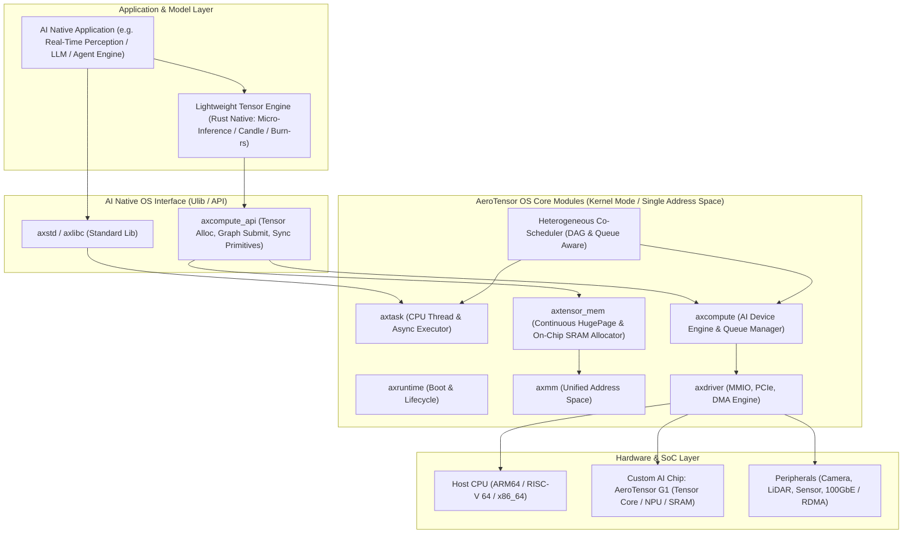

# AI Native OS 原型系統設計架構 (AeroTensor OS)

## 1. 什麼是真正的「AI Native OS」？

傳統作業系統（如 Linux）建立於半個世紀前的以 **CPU 為中心、以檔案與通用進程為核心抽象** 的馮·紐曼架構上：
- **CPU 是唯一的統籌者**，加速器（GPU / NPU）被視為外圍輔助設備（Peripheral Device），必須透過冗長的用戶態驅動（UMD）、內核態驅動（KMD）、字元設備 (`/dev/*`) 與 `ioctl` 跨越多層抽象呼叫。
- 數據管線充斥著多次記憶體拷貝、頁面鎖定（Pinning）、快取維護（Cache Invalidation/Flush）與特權級切換開銷。

**AI Native OS** 的核心典範轉移（Paradigm Shift）：
1. **「張量（Tensor）」成為作業系統的第一類公民（First-Class Citizen）**：
   - 就像傳統 OS 將「檔案描述符（File Descriptor）」與「記憶體頁（Page）」作為核心基石，AI Native OS 將具備維度、步長（Strides）、量化格式與硬體擺放位置（Placement）的「張量」作為原生抽象。
2. **計算重心轉移**：
   - CPU 退居為「控制平面（Control Plane）與圖排程直轄器」；
   - 自研 AI 晶片（如 AeroTensor G1）作為「數據平面（Data Plane）矩陣計算核心」；
   - 作業系統的核心任務是**以最高頻寬、最低延遲與完全確定的時間軸，餵飽 AI 晶片的張量計算單元**。

---

## 2. AeroTensor OS 總體架構圖

基於 ArceOS 的模組化 Unikernel 核心，我們建構了專為自研 AI 晶片設計的原型架構：



---

## 3. 核心子系統創新設計

### 3.1 原生張量記憶體子系統 (`axtensor_mem`)

在傳統 Linux 中，將影像張量載入模型推論往往經過：
`Camera Driver Buffer -> Linux VFS / V4L2 -> Userland Buffer -> CUDA/NPU Driver -> Pin Memory -> DMA to Device`，造成多次記憶體重複搬運與延遲抖動。

在 AeroTensor OS 中：
1. **單一位址空間直接訪問（Direct Access）**：
   - 由於 Unikernel 運行在單一位址空間，所有實體記憶體對應用程式和硬體驅動皆透明可見。
2. **三級儲存層次（Memory Tiering）**：
   - **L1 / Scratchpad**: 自研 AI 晶片晶上 SRAM（極低延遲、高頻寬，儲存當前算子權重與 Activation）。
   - **L2 / Local HBM / LPDDR**: AI 晶片專屬顯存或獨立記憶體通道。
   - **L3 / Host Unified Memory**: 系統主 DDR 記憶體，透過硬體 Coherent 匯流排或高頻寬 DMA 互聯。
3. **零拷貝管線（Zero-Copy Pipeline）**：
   - 透過 `axtensor_mem::alloc_tensor_buffer(layout, alignment)` 分配物理連續大頁（2MB / 1GB HugePage）。
   - 感測器資料直接 DMA 填入張量首地址；AI 晶片直接讀取該實體位址進行 GEMM/Conv 計算；推論結果指標直接交給網路或控制匯流排發送。全程 **0 次 CPU 記憶體複製**。

### 3.2 異構協同排程架構（Heterogeneous Co-Scheduling）

傳統作業系統排程器（如 Linux CFS）對外部加速器是「盲目（Blind）」的，僅排程發起系統調用的 CPU 執行緒，導致：
- CPU 執行緒被頻繁睡眠等待加速器中斷，造成上下文切換開銷。
- 無法根據計算圖依賴性動態調度 CPU 前處理與 NPU 運算重疊（Overlap）。

AeroTensor OS 的協同排程機制：
1. **硬體佇列映射（Hardware Queue as Primitive）**：
   - 將自研晶片的 **SQ (Submission Queue)** 與 **CQ (Completion Queue)** 直接對接到 OS 核心排程佇列。
2. **算子級非同步 Pipeline（Graph-level Asynchronous Pipelining）**：
   - 利用 Rust 的 `async/await` 與自研微核心執行緒機制：
   ```rust
   // 算子級協同：CPU 前處理與 AI 晶片運算同時流水線並行
   let dma_future = ai_device.submit_dma(input_tensor);
   let cpu_preprocess_future = cpu_worker.prepare_next_frame();
   let (dma_ok, _) = join!(dma_future, cpu_preprocess_future);
   let infer_future = ai_device.submit_kernel(OpGraph::MatMul, &params);
   ```
3. **優先順序搶佔（Priority-Driven AI QoS）**：
   - 支援即時高優先任務（例如自駕感知緊急剎車模型）搶占低優先批次任務（如背景日誌特徵提取），AI 晶片支援硬體級任務暫停/上下文切換（Hardware Context Preemption）。

### 3.3 確定性執行與超低抖動（Ultra-Low Jitter）

對於工業自動化、機器人運動控制與邊緣無人載具：
- **Jitter 致命性**：平均推論延遲 5ms，但若偶發一次 50ms 的延遲尖刺，可能導致物理實體失控。
- **ArceOS Unikernel 保障**：
  - 剔除虛擬記憶體交換分頁（Swap Thrashing）。
  - 剔除分時多用戶的進程間 CPU 爭搶。
  - 中斷處理採用混合輪詢機制（Hybrid Polling / Adaptive IRQ）：在極限推論負載下切換至純硬體 Doorbell 輪詢，消滅中斷上下文切換開銷；空閒時退回中斷模式節省功耗。
