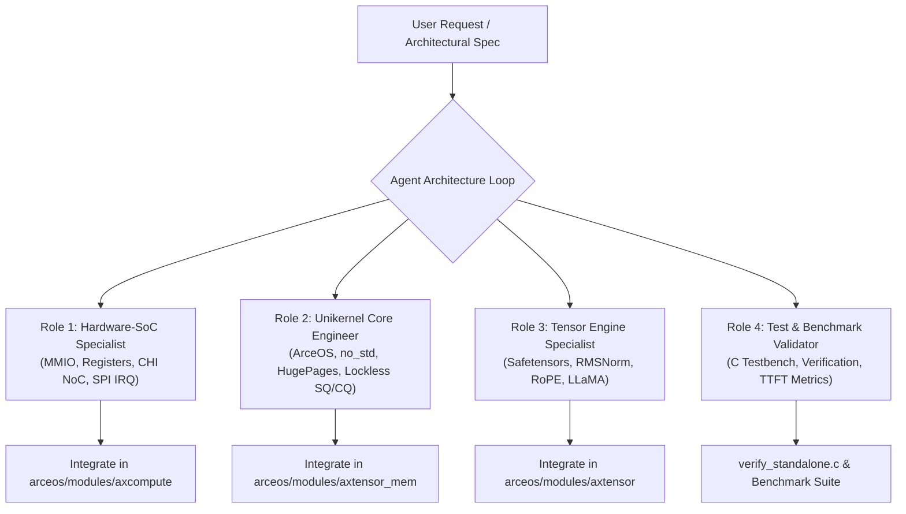
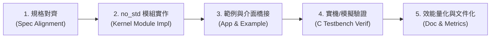

# AeroTensor-G1: AI Agent Co-Programming Workflow & Skill Guide
# 自主 AI Agent 協同研發工作流與工程技能規範

---

## 1. 概述 (Overview)

AeroTensor-G1 AI-Native OS 是一個貫穿「專用晶片架構 (SoC/NoC/HBM)」、「Unikernel 核心 (ArceOS)」、「零拷貝記憶體體系 (`axtensor_mem`)」、「算子與驅動抽象 (`axcompute`)」到「大模型推論引擎 (`axtensor`)」的全棧系統。

本專案採用 **自主 AI 程式碼助理 (Agentic AI Assistant)** 進行軟硬體協同設計（Hardware-Software Co-Design）。為了確保跨會話、跨任務以及團隊其他開發者/Agent 能夠無縫協同，本文件定義了完整的 **Agent Workflow（工作流程）** 與 **Workspace Skill（專案自定義技能）**。

---

## 2. Agent 角色分工與心智模型 (Agent Personas & Mental Model)

在推動 AI-Native OS 開發時，Agent 遵循四層架構的心智模型進行推理與實作：



1. **硬體架構師 (Hardware-SoC Specialist)**：
   * 專注於 AeroTensor-G1 暫存器規格（Magic `0xAE706101`、Control/Status、SQ/CQ 門鈴 Doorbell）。
   * 確保 SQE 為嚴格 64 位元組對齊（佔據單一快取行）、CQE 為 16 位元組對齊。
   * 管理 AMBA 5 CHI 硬體一致性與 GICv3 SPI 64~79 中斷分發。
2. **內核底層工程師 (Unikernel Core Engineer)**：
   * 堅持 `no_std` 哲學，絕不引入任何動態堆疊配置（Zero Heap Allocation）。
   * 管理三級記憶體結構（L1 Scratchpad 16MB、L2 Local HBM 16GB、L3 Host UMA 96GB）。
   * 確保 1GB 大頁（Level 1 Translation）與 2MB 巨大頁對齊。
3. **張量與模型架構師 (Tensor Engine Specialist)**：
   * 執行「外借其形，內造其心」策略，實作與 Candle 風格相容但底層完全直通的算子。
   * 實作零拷貝 Safetensors 實體位址直通解析器與 2MB 槽位式 KV-Cache。
   * 負責 `MultiModelRegistry` 空間分區（`tile_mask`）與衝突檢測。
4. **驗證與效能專家 (Test & Benchmark Validator)**：
   * 維護 100% 獨立的硬體驗證測試套件 (`tests/verify_standalone.c`)。
   * 量化冷啟動延遲 (TTFT)、解碼吞吐量 (Tokens/s) 與硬體 Reduction Tree 脈衝時間。

---

## 3. 標準工程研發工作流 (Standard 5-Step Workflow)

Agent 在執行任一功能模組的新增或重構時，嚴格遵循五步驟閉環工作流：



### 步驟 1: 規格對齊 (Spec Alignment)
* 查閱 `docs/00_aerotensor_g1_sdd.md` 與暫存器對齊表。
* 檢查記憶體佈局（Base PAddr、長度、大頁對齊約束）。

### 步驟 2: `no_std` 模組實作 (Kernel Module Implementation)
* 在 `arceos/modules/` 中擴展 Rust Crates。
* 必須標註 `#![no_std]`。
* 禁用動態配置 `alloc::vec` 或 `alloc::format` 於熱路徑中，使用靜態固定大小陣列或大頁切片。

### 步驟 3: 應用層範例建立 (Examples Integration)
* 在 `arceos/examples/` 中建立可獨立執行的展示應用程式（如 `ai-gemm-demo`、`ai-llm-inference`）。

### 步驟 4: 獨立硬體驗證測試 (Testbench Verification)
* 更新 `tests/verify_standalone.c`，納入新功能單元測試。
* 編譯並執行：
  ```bash
  gcc -O2 -Wall -Wextra tests/verify_standalone.c -o tests/verify_standalone -lm
  ./tests/verify_standalone
  ```
* 必須達成 `[SUCCESS] ALL INTEGRATION TESTS PASSED (100% Verified)`，無警告、無錯誤。

### 步驟 5: 效能量化與同步文件 (Doc & Metrics Synchronization)
* 將冷啟動延遲、吞吐量與硬體指標記錄至 `docs/` 與 `README.md`。

---

## 4. 專案自定義技能 (Workspace Skill: `aerotensor-dev`)

本專案於 `.agents/skills/aerotensor-dev/` 註冊了專用工作技能。
當 AI Agent 接收到硬體擴充、算子最佳化或多模型載入任務時，可啟動此技能以自動裝載最佳實踐與檢查清單。

### 4.1 核心命令速查 (Quick Commands)

| 目的 | 指令 |
| :--- | :--- |
| **執行全系統獨立驗證** | `gcc -O2 -Wall -Wextra tests/verify_standalone.c -o tests/verify_standalone -lm && ./tests/verify_standalone` |
| **檢查 ArceOS 模組依賴** | `cargo check --manifest-path arceos/Cargo.toml` |
| **啟動 QEMU 模擬器服務** | `./scripts/run_qemu_server.sh` |
| **檢查 Git 狀態** | `git status` |

### 4.2 避坑指南與黃金法則 (Pitfall Prevention & Golden Rules)
1. **SQE 結構體大小陷阱**：
   `AeroTensorSQE` 必須精確等於 64 Bytes，對應一條 Cacheline。不可隨意增加額外 padding 欄位，否則在 `#[repr(align(64))]` 下會膨脹為 128 Bytes，導致硬體 Ring Buffer 指針錯位！
2. **硬體 CMO Bypass 邊界**：
   在 AMBA 5 CHI 一致性域內，CPU 與 NPU 共享 L3 Cache，此時**切勿**呼叫軟體快取沖刷（Cache Flush），否則會引入微秒級不必要的無效化開銷。
3. **KV-Cache 記憶體碎裂防護**：
   KV-Cache 嚴格綁定 2MB 巨大頁槽位，禁止在解碼迴圈中做任何切片擴容或堆配置。
